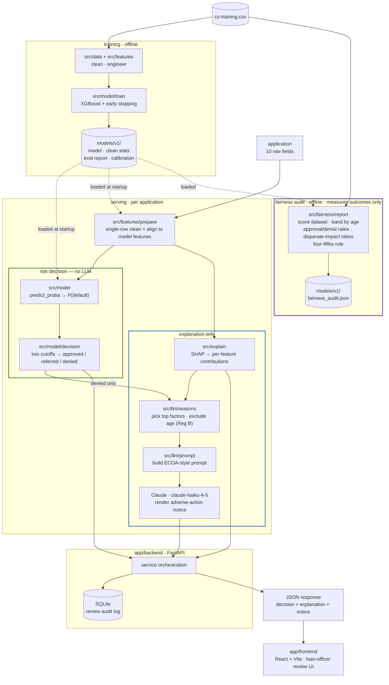

# Credit Underwriting Demo

A demonstration credit-risk underwriting pipeline: a gradient-boosted model
makes the risk decision, SHAP explains it, and an LLM translates that
explanation into plain-language, ECOA-style adverse-action rationale for a
loan-officer-facing review UI.

See `CLAUDE.md` for full architecture, conventions, and build-phase plan.

## Status
Pipeline runs end to end from the command line and over HTTP.

- ✅ Data layer — loading, cleaning, feature engineering
- ✅ Model layer — XGBoost training, eval report (AUC / KS / calibration), versioned artifacts
- ✅ Explainability — per-application SHAP contributions as structured data
- ✅ LLM layer — SHAP dict → ECOA-style adverse-action text (Claude, `claude-haiku-4-5` by default)
- ✅ Backend — FastAPI wrapping the whole pipeline, SQLite audit log
- ✅ Frontend — React + Vite loan-officer review UI (`app/frontend/`)
- ✅ Fairness audit — age-band selection/denial rates, disparate-impact ratios, four-fifths rule (`src/fairness/`)

## Architecture



The gradient-boosted model produces the score **and** the decision; SHAP
explains it; the LLM only turns the SHAP output into adverse-action prose,
and only for denials. Nothing on the explanation path feeds back into the
decision. The fairness audit sits entirely downstream: it re-scores a
dataset through the *same* decision policy and measures how the three bands
fall across age groups — it never scores or re-decides an application.

## Layout
```
data/            raw and processed datasets (gitignored)
src/data/        dataset loading + cleaning
src/features/    feature engineering + single-row inference prep
src/model/       training, evaluation, decision policy, artifact persistence
src/explain/     SHAP explainability
src/llm/         SHAP -> plain-language adverse-action text
src/fairness/    post-hoc group fairness audit (age-band disparate impact)
app/backend/     FastAPI service
app/frontend/    loan-officer review UI
models/          versioned trained model artifacts (gitignored)
scripts/         end-to-end command-line pipeline run
tests/           unit + integration tests, mirrors src/ structure
```

## Setup
```bash
pip install -r requirements.txt
```

## Dataset
Download Kaggle's "Give Me Some Credit" data and place `cs-training.csv`
under `data/raw/`. Not committed to the repo.

## Train a model
```bash
python -m src.model.train            # writes models/v1/ (model, eval report, calibration plot)
python -m src.model.report v1        # re-print a version's AUC / KS / Brier
```

## Command-line pipeline
```bash
python -m scripts.run_pipeline --row 5                    # data -> model -> SHAP -> notice
python -m scripts.run_pipeline --row 5 --print-prompt-only  # no LLM call
```

## Run the API
```bash
cp .env.example .env          # then set ANTHROPIC_API_KEY (optional; falls back to an offline stub)
uvicorn app.backend.main:app --reload
```

| Method | Path | Purpose |
| --- | --- | --- |
| `GET`  | `/health` | model version + which LLM (`anthropic` / `stub`) |
| `POST` | `/predict` | application → probability + three-band decision |
| `POST` | `/explain` | application → structured SHAP contributions |
| `POST` | `/adverse-action` | denials only → statement of specific reasons (`409` otherwise) |
| `POST` | `/review` | full pipeline, persisted; returns a record id |
| `GET`  | `/applications`, `/applications/{id}` | stored review records |

### Decision policy

The model outputs `P(serious delinquency)`; `src/model/decision.py` applies
two cutoffs (tuned on the v1 validation split, overridable via
`AIU_APPROVE_BELOW` / `AIU_DENY_AT_OR_ABOVE`):

| Band | Rule | Adverse-action notice |
| --- | --- | --- |
| `approved` | `P < 0.08` | none |
| `referred` | `0.08 ≤ P < 0.30` | none (routed to a loan officer) |
| `denied`   | `P ≥ 0.30` | generated |

### `POST /review` — one example per band

Run against `models/v1` with a real API key (`llm_provider: anthropic`,
`model: claude-haiku-4-5`). Each call also persists a record.

**Approved** — `P(default) = 0.0219`
```json
{
  "id": 1,
  "decision": {"decision": "approved", "probability": 0.0219,
               "thresholds": {"approve_below": 0.08, "deny_at_or_above": 0.3}},
  "adverse_action": null
}
```

**Referred** — `P(default) = 0.0838`
```json
{
  "id": 2,
  "decision": {"decision": "referred", "probability": 0.0838,
               "thresholds": {"approve_below": 0.08, "deny_at_or_above": 0.3}},
  "adverse_action": null
}
```

**Denied** — `P(default) = 0.3809`
```json
{
  "id": 3,
  "decision": {"decision": "denied", "probability": 0.3809,
               "thresholds": {"approve_below": 0.08, "deny_at_or_above": 0.3}},
  "adverse_action": {
    "llm_provider": "anthropic",
    "model": "claude-haiku-4-5",
    "reason_features": [
      "total_past_due_count",
      "NumberRealEstateLoansOrLines",
      "RevolvingUtilizationOfUnsecuredLines",
      "DebtRatio"
    ],
    "notice_text": "Your application for credit has been denied for the following specific reasons:\n\n• Number of separate periods with past-due payments in your history\n• Number of real-estate-secured loans or lines of credit on your file\n• Proportion of your available revolving credit that is currently in use\n• Level of your monthly debt payments relative to your monthly income\n\nYou have the right to request a copy of any credit report used in this decision and to dispute the accuracy of information in your credit file."
  }
}
```

Age and every age-derived feature are excluded from `reason_features`
regardless of SHAP rank (Regulation B, 12 CFR 1002.6(b)(2)).

## Run the frontend

A React + Vite loan-officer UI over the API: a form to run new applications
through `/review`, a filterable queue of stored records, and a per-record view
with the probability placed against the two cutoffs, a diverging SHAP chart of
the per-feature contributions, and the adverse-action notice for denials.

```bash
uvicorn app.backend.main:app --reload      # backend on :8000 (as above)

cd app/frontend
npm install
npm run dev                                # http://localhost:5173
```

The dev server proxies `/api/*` to the backend, so no CORS setup is needed
locally. A separately hosted build calls the API cross-origin; list its origin
in `AIU_CORS_ORIGINS`. See `app/frontend/README.md` for details.

## Fairness audit (`src/fairness/`)

An independent, post-hoc layer that re-scores a dataset through the exact
serving decision policy and measures how the three bands fall across
demographic groups. It runs **after** the model decides and feeds nothing
back — it cannot change a score or a decision (the core architectural rule).

```bash
python -m src.fairness.report v1                 # audit models/v1 on the validation split
python -m src.fairness.report v1 --split all     # audit on the whole dataset
python -m src.fairness.report v1 --print-only    # print, write no artifact
```

The JSON report is written to `models/<version>/fairness_audit.json`,
alongside the model it audits; the model's own immutable files are never
touched, and an existing report is only replaced with `--force`.

**What it computes** (all as plain dicts / DataFrames, per the cross-layer
convention):

| Metric | Definition |
| --- | --- |
| approval / referral / denial rate per group | share of each group placed in that band |
| adverse-impact ratio (AIR) | group approval rate ÷ approval rate of the most-approved group |
| four-fifths rule | AIR `< 0.80` for any group is flagged (`passes: false`) |
| denial-rate ratio | group denial rate ÷ denial rate of the least-denied group; flagged `> 1.25` |

An "acceptance" AIR (approved **or** referred, i.e. "not denied") is
reported alongside the strict approval AIR, since a referral is not itself
an adverse action.

### Protected attribute — and its limitation

"Give Me Some Credit" carries no race, sex, ethnicity, national-origin, or
marital-status fields. `age` is the only demographic attribute in it, and
age is an ECOA-protected basis, so the audit groups applicants by the **same
age bands** the feature layer already bins to (`src/features/engineer.py`).
This is a dataset limitation, not a modelling choice: a production
fair-lending audit would repeat every metric here for race, sex, national
origin, marital status, age (≥ 62), and receipt of public assistance —
typically via a proxy method such as BISG where those attributes are not
collected directly.

### How the design connects to ECOA adverse-action requirements

ECOA and Regulation B require that a declined applicant receive the
**specific, accurate principal reasons** for the decision, and separately
that a creditor's policies not produce an unjustified **disparate impact**
on a protected basis. The pipeline is built around both halves:

- **Reasons are accurate by construction.** The gradient-boosted model
  makes the decision; SHAP identifies the factors that actually moved *that*
  application; the LLM only renders those factors into sentences. It has no
  access to the model or the score and cannot introduce, drop, or re-rank a
  reason — so what the applicant is told always matches why the model
  decided.
- **Age is never given as a reason.** Age and every age-derived feature are
  removed from the adverse-action reason list regardless of SHAP rank
  (Reg B, 12 CFR 1002.6(b)(2)). An applicant is never told they were denied
  because of their age.
- **The three bands keep denials narrow and reviewable.** Only `denied`
  triggers a notice; the ambiguous middle band is `referred` to a human
  rather than auto-declined, which shrinks the set of decisions that must
  carry a statement of specific reasons.
- **The audit closes the loop.** Adverse-action notices explain individual
  decisions; this audit checks the *aggregate* pattern of those same
  decisions for disparate impact on a protected basis.

### Reading the v1 result

On the shipped v1 model the audit flags **REVIEW**: `age` is a model
feature and older applicants are genuinely lower-risk in this dataset, so
the youngest bands sit well below the 0.80 approval AIR and above the 1.25
denial-rate ratio. That is exactly the signal the audit exists to surface.
A production response would be a less-discriminatory-alternative search —
e.g. removing `age` and the age-derived features from the model, or
constraining/monitoring their effect — followed by re-running this audit;
the point of keeping the audit as its own layer is that such a change is
measured here without touching the decision, explanation, or LLM code.

## Tests
```bash
pytest -q
```
