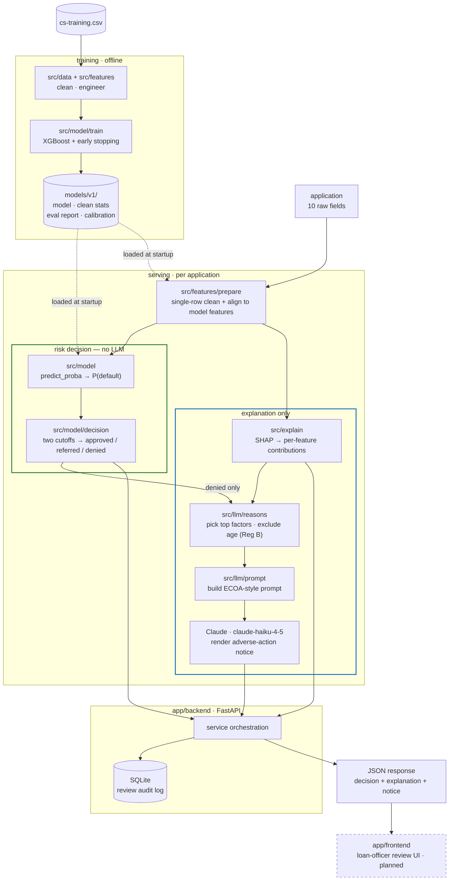

# Credit Underwriting Demo

A demonstration credit-risk underwriting pipeline: a gradient-boosted model
makes the risk decision, SHAP explains it, and an LLM translates that
explanation into plain-language, ECOA-style adverse-action rationale for a
loan-officer-facing review UI.

See `CLAUDE.md` for full architecture, conventions, and build-phase plan.

## Status
Pipeline runs end to end from the command line and over HTTP.

- ✅ Data layer — loading, cleaning, feature engineering
- ✅ Model layer — XGBoost training, eval report (AUC / KS / calibration), versioned artifacts
- ✅ Explainability — per-application SHAP contributions as structured data
- ✅ LLM layer — SHAP dict → ECOA-style adverse-action text (Claude, `claude-haiku-4-5` by default)
- ✅ Backend — FastAPI wrapping the whole pipeline, SQLite audit log
- ⬜ Frontend — loan-officer review UI
- ⬜ Fairness audit — disparate-impact ratios

## Architecture



The gradient-boosted model produces the score **and** the decision; SHAP
explains it; the LLM only turns the SHAP output into adverse-action prose,
and only for denials. Nothing on the explanation path feeds back into the
decision.

## Layout
```
data/            raw and processed datasets (gitignored)
src/data/        dataset loading + cleaning
src/features/    feature engineering + single-row inference prep
src/model/       training, evaluation, decision policy, artifact persistence
src/explain/     SHAP explainability
src/llm/         SHAP -> plain-language adverse-action text
app/backend/     FastAPI service
app/frontend/    loan-officer review UI
models/          versioned trained model artifacts (gitignored)
scripts/         end-to-end command-line pipeline run
tests/           unit + integration tests, mirrors src/ structure
```

## Setup
```bash
pip install -r requirements.txt
```

## Dataset
Download Kaggle's "Give Me Some Credit" data and place `cs-training.csv`
under `data/raw/`. Not committed to the repo.

## Train a model
```bash
python -m src.model.train            # writes models/v1/ (model, eval report, calibration plot)
python -m src.model.report v1        # re-print a version's AUC / KS / Brier
```

## Command-line pipeline
```bash
python -m scripts.run_pipeline --row 5                    # data -> model -> SHAP -> notice
python -m scripts.run_pipeline --row 5 --print-prompt-only  # no LLM call
```

## Run the API
```bash
cp .env.example .env          # then set ANTHROPIC_API_KEY (optional; falls back to an offline stub)
uvicorn app.backend.main:app --reload
```

| Method | Path | Purpose |
| --- | --- | --- |
| `GET`  | `/health` | model version + which LLM (`anthropic` / `stub`) |
| `POST` | `/predict` | application → probability + three-band decision |
| `POST` | `/explain` | application → structured SHAP contributions |
| `POST` | `/adverse-action` | denials only → statement of specific reasons (`409` otherwise) |
| `POST` | `/review` | full pipeline, persisted; returns a record id |
| `GET`  | `/applications`, `/applications/{id}` | stored review records |

### Decision policy

The model outputs `P(serious delinquency)`; `src/model/decision.py` applies
two cutoffs (tuned on the v1 validation split, overridable via
`AIU_APPROVE_BELOW` / `AIU_DENY_AT_OR_ABOVE`):

| Band | Rule | Adverse-action notice |
| --- | --- | --- |
| `approved` | `P < 0.08` | none |
| `referred` | `0.08 ≤ P < 0.30` | none (routed to a loan officer) |
| `denied`   | `P ≥ 0.30` | generated |

### `POST /review` — one example per band

Run against `models/v1` with a real API key (`llm_provider: anthropic`,
`model: claude-haiku-4-5`). Each call also persists a record.

**Approved** — `P(default) = 0.0219`
```json
{
  "id": 1,
  "decision": {"decision": "approved", "probability": 0.0219,
               "thresholds": {"approve_below": 0.08, "deny_at_or_above": 0.3}},
  "adverse_action": null
}
```

**Referred** — `P(default) = 0.0838`
```json
{
  "id": 2,
  "decision": {"decision": "referred", "probability": 0.0838,
               "thresholds": {"approve_below": 0.08, "deny_at_or_above": 0.3}},
  "adverse_action": null
}
```

**Denied** — `P(default) = 0.3809`
```json
{
  "id": 3,
  "decision": {"decision": "denied", "probability": 0.3809,
               "thresholds": {"approve_below": 0.08, "deny_at_or_above": 0.3}},
  "adverse_action": {
    "llm_provider": "anthropic",
    "model": "claude-haiku-4-5",
    "reason_features": [
      "total_past_due_count",
      "NumberRealEstateLoansOrLines",
      "RevolvingUtilizationOfUnsecuredLines",
      "DebtRatio"
    ],
    "notice_text": "Your application for credit has been denied for the following specific reasons:\n\n• Number of separate periods with past-due payments in your history\n• Number of real-estate-secured loans or lines of credit on your file\n• Proportion of your available revolving credit that is currently in use\n• Level of your monthly debt payments relative to your monthly income\n\nYou have the right to request a copy of any credit report used in this decision and to dispute the accuracy of information in your credit file."
  }
}
```

Age and every age-derived feature are excluded from `reason_features`
regardless of SHAP rank (Regulation B, 12 CFR 1002.6(b)(2)).

## Tests
```bash
pytest -q
```
